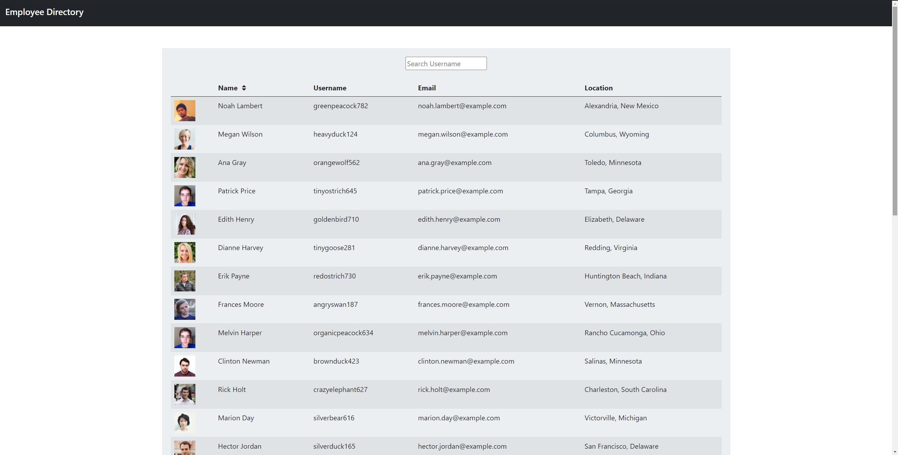

# Employee Directory 

## Description 

Generated a random list of "employees" through react components that you can sort and search through!

Technologies used:
- JavaScript
- React JS

## Table of Contents

* [Installation](#installation)
* [Usage](#usage)
* [Questions](#questions)
* [License](#license)

## Installation
Nothing needs to be installed! App link: https://rgl10d.github.io/employee-directory/

## Usage 

The employee chart will automatically be generated upon loading the page. To sort the table by first name, hit the double arrows next to "Name" once for ascending order and once more after that for descending order. Type in a username in the search box and it will narrow down the results with employees that have usernames that match your input.

## Questions?

Visit me at my GitHub page: https://www.github.com/rgl10d

Or email me: rgl10d@gmail.com

## License

MIT License

Copyright © [2021] [Garrett Lee]

Permission is hereby granted, free of charge, to any person obtaining a copy
of this software and associated documentation files (the "Software"), to deal
in the Software without restriction, including without limitation the rights
to use, copy, modify, merge, publish, distribute, sublicense, and/or sell
copies of the Software, and to permit persons to whom the Software is
furnished to do so, subject to the following conditions:

The above copyright notice and this permission notice shall be included in all
copies or substantial portions of the Software.

THE SOFTWARE IS PROVIDED "AS IS", WITHOUT WARRANTY OF ANY KIND, EXPRESS OR
IMPLIED, INCLUDING BUT NOT LIMITED TO THE WARRANTIES OF MERCHANTABILITY,
FITNESS FOR A PARTICULAR PURPOSE AND NONINFRINGEMENT. IN NO EVENT SHALL THE
AUTHORS OR COPYRIGHT HOLDERS BE LIABLE FOR ANY CLAIM, DAMAGES OR OTHER
LIABILITY, WHETHER IN AN ACTION OF CONTRACT, TORT OR OTHERWISE, ARISING FROM,
OUT OF OR IN CONNECTION WITH THE SOFTWARE OR THE USE OR OTHER DEALINGS IN THE
SOFTWARE.
